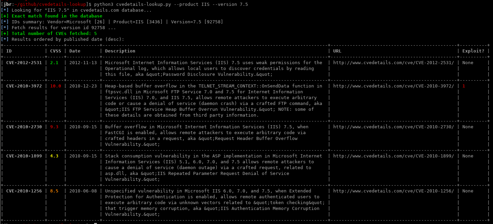

=================
Cvedetails-lookup
=================

**Small script to perform CVE lookup on cvedetails.com Database (https://www.cvedetails.com)**.

This script requests cvedetails.com to search for CVE on a given product.

============
Installation
============

Install Python3 dependencies:

.. code-block:: console

    sudo pip3 install -r requirements.txt

=====
Usage
=====

**Search for CVE on a given product:**

.. code-block:: console

    python3 cvedetails-lookup.py --vendor 'vendor name' --product 'product name' --version 'version'

**When there is no ambiguity on vendor name, it can be omitted:**

.. code-block:: console

    python3 cvedetails-lookup.py --product 'product name' --version 'version'

=======
Example
=======

**Search for CVE on Microsoft IIS 7.5:**

.. code-block:: console

    python3 cvedetails-lookup.py --product IIS --version 7.5

